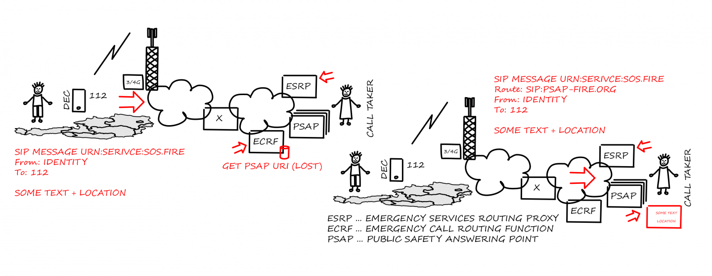

# Deaf Emergency Call 112 (dec112) API services

Providing standard based text chat emergency communication services.
The "big-picture" shows an overview of the DEC112 landscape and how
text based emergency chats are routed based on their location.

This project implements the backend registration and configuration API services
(RegAPI). These services are needed to register and configure DEC112 clients
e.g. the DEC112 Android & IOS App so that they can then make text based 
emergency chats via SIP proxies and the DEC112 border gateway services.

The RegAPI developed during the

* [DEC112 - Deaf Emergency Call](https://www.netidee.at/dec112)

project was used as the basis to develop non overlapping
functions for the following research projects:

* [DEC112-v2.0 - Deaf Emergency Call v2.0](https://www.netidee.at/dec112-20)

* [DECTS - Deaf Emergency Chat and Training System](https://www.dec112.at/dects/)

Additional information, news and project status can be found on the DEC112 Homepage [www.dec112.at](https://www.dec112.at).

## Installation
To install ensure you have the following dependencies installed:

1. **node.js**:
   download and install node from https://nodejs.org/en/

2. If you install from distribution ZIP file:
    * A zip unpacker
    * Unzip the dec112-api-*version*.zip archive somewhere on your server

3. If you install from distribution GIT repository
    * execute `git checkout`

4. Change into the dist folder inside dec112-api root and enter
   `npm install --production`

   *Note: This step is not needed if the distribution ZIP contains a `node_modules` folder*.

5. Change/create configuration in `dist/config/env` according to your needs

6. Change `start_server` script in root directory to match your configuration

7. Install latest [Postgresql](https://www.postgresql.org/) database

8. The `install` folder contains scripts to setup the database:
   * `create_db.sh`: creates a new DEC112 RegAPI database.

      **NOTE: This script ALWAYS creates a new database - meaning it DELETES ANY PREVIOUS DATABASE !!!**

## Documentation
The following link provide additional information about various aspects of the DEC112 RegAPI:

* [API documentation as PDF](docs/dec112-reg-api.pdf)

## Development
To start development ensure you have the following dependencies installed:

### Prerequisites
1. Install (**node.js**) and (**npm**)
   * download and install node from https://nodejs.org/en/

2. Grunt command line utility (**grunt-cli**)
   * install using `npm install -g grunt-cli`

3. Type definitions

   install using `npm install -g typings`

4. Bower

   install using `npm install -g bower`

5. Visual Studio Code (**vscode**) or any other IDE
   Download and install from https://code.visualstudio.com/

Then clone the repository with `git clone` and inside the
dec112-api project root folder issue the following commands:

1. To init the submodules (if any):
   * `git submodule init`
   * `git submodule update`
2. To fetch all dependency modules:
   * `npm install`
3. To install code information:
   * `typings install`
4. Tp install client components:
   * `bower install`
5. Open dec112-api folder with vscode and start coding
6. `CTRL+SHIFT+B` in vscode builds project - or -
   to build project from command line enter `grunt build`
7. After build, `dist` folder contains redistributable built project
   (also available as compressed archive in `releases` folder)

## Contributing
1. Fork it!
2. Create your feature branch: `git checkout -b my-new-feature`
3. Commit your changes: `git commit -am 'Add some feature'`
4. Push to the branch: `git push origin my-new-feature`
5. Submit a pull request

## Warranty
---

This software is a prototypically implementation of a lightweight,
web based, integrated solution for handling deaf emergency
communications in a text based chat. There is **ABSOLUTELY NO
GUARANTY** that it works as expected! As emergency communication is
critical, use this software at your own risk! The authors accept no
liability for any incidents resulting from using this software!

---

## License
This project is under modified GNU GPLv3.
See file LICENSE in project folder.

COMMERCIAL USAGE PROHIBITED
